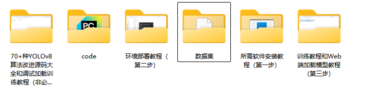

# 耳机检测检测系统源码分享
 # [一条龙教学YOLOV8标注好的数据集一键训练_70+全套改进创新点发刊_Web前端展示]

### 1.研究背景与意义

项目参考[AAAI Association for the Advancement of Artificial Intelligence](https://gitee.com/qunmasj/projects)

项目来源[AACV Association for the Advancement of Computer Vision](https://kdocs.cn/l/cszuIiCKVNis)

研究背景与意义

随着科技的迅猛发展，耳机作为一种重要的消费电子产品，已经成为人们日常生活中不可或缺的配件。耳机的种类繁多，从传统的有线耳机到现代的无线耳机，各种款式和功能层出不穷。耳机的广泛应用不仅推动了相关产业的发展，也带来了市场竞争的加剧。在这种背景下，如何有效地进行耳机的检测与识别，成为了计算机视觉领域亟待解决的一个重要问题。

近年来，深度学习技术的快速发展为物体检测提供了新的解决方案。YOLO（You Only Look Once）系列模型因其高效的实时检测能力而受到广泛关注。YOLOv8作为该系列的最新版本，进一步提升了检测精度和速度，适用于各种复杂场景。然而，现有的YOLOv8模型在特定应用场景下仍存在一定的局限性，尤其是在耳机等小型物体的检测上。因此，基于改进YOLOv8的耳机检测系统的研究具有重要的理论价值和实际意义。

本研究的主要目标是通过改进YOLOv8模型，提升耳机检测的准确性和鲁棒性。为此，我们构建了一个专门针对耳机的检测数据集，包含1500张耳机图像，旨在为模型的训练和测试提供丰富的样本数据。该数据集不仅涵盖了不同品牌、不同款式的耳机，还考虑了不同的拍摄角度和光照条件，以增强模型的泛化能力。通过对数据集的深入分析，我们可以更好地理解耳机在不同环境下的特征，从而为模型的改进提供依据。

在实际应用中，耳机检测系统可以广泛应用于智能零售、库存管理、用户行为分析等多个领域。例如，在智能零售环境中，耳机检测系统可以实时监测货架上的耳机数量，帮助商家优化库存管理；在用户行为分析中，系统可以通过检测耳机的佩戴情况，分析用户的使用习惯和偏好。这些应用不仅能够提升用户体验，还能为企业提供重要的市场洞察。

此外，基于改进YOLOv8的耳机检测系统的研究也为计算机视觉领域的其他应用提供了借鉴。通过对小型物体检测技术的探索，我们可以为其他类似问题的解决提供新的思路和方法。这不仅有助于推动耳机检测技术的发展，也为整个物体检测领域的进步贡献力量。

综上所述，基于改进YOLOv8的耳机检测系统的研究，不仅具有重要的学术价值，也具有广泛的应用前景。通过对耳机检测技术的深入研究，我们希望能够为相关领域的发展提供有力支持，并推动智能化技术在消费电子产品中的应用。

### 2.图片演示


##### 注意：由于此博客编辑较早，上面“2.图片演示”和“3.视频演示”展示的系统图片或者视频可能为老版本，新版本在老版本的基础上升级如下：（实际效果以升级的新版本为准）

  （1）适配了YOLOV8的“目标检测”模型和“实例分割”模型，通过加载相应的权重（.pt）文件即可自适应加载模型。

  （2）支持“图片识别”、“视频识别”、“摄像头实时识别”三种识别模式。

  （3）支持“图片识别”、“视频识别”、“摄像头实时识别”三种识别结果保存导出，解决手动导出（容易卡顿出现爆内存）存在的问题，识别完自动保存结果并导出到tempDir中。

  （4）支持Web前端系统中的标题、背景图等自定义修改，后面提供修改教程。

  另外本项目提供训练的数据集和训练教程,暂不提供权重文件（best.pt）,需要您按照教程进行训练后实现图片演示和Web前端界面演示的效果。

### 3.视频演示

[3.1 视频演示](https://www.bilibili.com/video/BV19ExTePEEw/)

### 4.数据集信息展示

##### 4.1 本项目数据集详细数据（类别数＆类别名）

nc: 1
names: ['earphone']


##### 4.2 本项目数据集信息介绍

数据集信息展示

在现代计算机视觉领域，耳机检测作为一个重要的应用场景，正逐渐受到研究者和开发者的关注。为此，我们构建了一个专门用于训练和改进YOLOv8耳机检测系统的数据集，命名为“yolov7_earphone”。该数据集旨在为耳机检测提供高质量的标注数据，帮助提升模型的准确性和鲁棒性。

“yolov7_earphone”数据集包含了丰富的耳机图像样本，专注于单一类别的检测任务。数据集中仅包含一个类别，即“耳机”，这使得模型在训练过程中能够集中学习耳机的特征，从而在实际应用中实现更高的检测精度。尽管类别数量有限，但我们确保了数据集的多样性和代表性，以涵盖不同类型、颜色和形状的耳机。这种多样性对于训练一个能够在各种环境和条件下有效工作的检测系统至关重要。

在数据集的构建过程中，我们采用了多种数据采集和增强技术，以确保样本的丰富性和多样性。我们从多个来源收集了耳机的图像，包括在线商店、社交媒体和用户生成内容等。这些图像不仅包括耳机的正面视图，还涵盖了侧面、背面和不同光照条件下的图像。这种多角度、多场景的图像采集方式，使得模型能够更好地理解耳机在不同环境下的外观特征。

此外，为了增强数据集的实用性，我们还进行了数据增强处理。通过旋转、缩放、裁剪和颜色调整等技术，我们生成了大量的变体图像。这些变体不仅增加了数据集的规模，还提高了模型对不同视觉变换的适应能力。这种数据增强策略对于提高YOLOv8模型的泛化能力至关重要，使其能够在面对未见过的图像时，依然保持良好的检测性能。

在标注方面，我们采用了严格的标注标准，确保每一张图像中的耳机都被准确地框定和标记。标注过程由经验丰富的标注员完成，他们经过专业培训，能够识别出耳机的各种细微特征。这种高质量的标注不仅提高了数据集的可靠性，也为模型的训练提供了坚实的基础。

“yolov7_earphone”数据集的设计理念是为了满足耳机检测系统的实际需求，推动相关技术的发展。随着耳机市场的不断扩大，智能耳机、无线耳机等新型产品层出不穷，耳机检测的需求也愈发迫切。通过使用该数据集，我们期望能够训练出一个高效、准确的YOLOv8耳机检测系统，为智能设备的应用提供更为强大的支持。

总之，“yolov7_earphone”数据集不仅是一个用于训练YOLOv8模型的工具，更是推动耳机检测技术进步的重要资源。通过不断优化和完善数据集，我们相信可以为耳机检测领域带来新的突破，助力相关技术的创新与发展。


### 5.全套项目环境部署视频教程（零基础手把手教学）

[5.1 环境部署教程链接（零基础手把手教学）](https://www.ixigua.com/7404473917358506534?logTag=c807d0cbc21c0ef59de5)


[5.2 安装Python虚拟环境创建和依赖库安装视频教程链接（零基础手把手教学）](https://www.ixigua.com/7404474678003106304?logTag=1f1041108cd1f708b01a)

### 6.手把手YOLOV8训练视频教程（零基础小白有手就能学会）

[6.1 手把手YOLOV8训练视频教程（零基础小白有手就能学会）](https://www.ixigua.com/7404477157818401292?logTag=d31a2dfd1983c9668658)

### 7.70+种全套YOLOV8创新点代码加载调参视频教程（一键加载写好的改进模型的配置文件）

[7.1 70+种全套YOLOV8创新点代码加载调参视频教程（一键加载写好的改进模型的配置文件）](https://www.ixigua.com/7404478314661806627?logTag=29066f8288e3f4eea3a4)

### 8.70+种全套YOLOV8创新点原理讲解（非科班也可以轻松写刊发刊，V10版本正在科研待更新）

由于篇幅限制，每个创新点的具体原理讲解就不一一展开，具体见下列网址中的创新点对应子项目的技术原理博客网址【Blog】：


[8.1 70+种全套YOLOV8创新点原理讲解链接](https://gitee.com/qunmasj/good)

### 9.系统功能展示（检测对象为举例，实际内容以本项目数据集为准）

图9.1.系统支持检测结果表格显示

  图9.2.系统支持置信度和IOU阈值手动调节

  图9.3.系统支持自定义加载权重文件best.pt(需要你通过步骤5中训练获得)

  图9.4.系统支持摄像头实时识别

  图9.5.系统支持图片识别

  图9.6.系统支持视频识别

  图9.7.系统支持识别结果文件自动保存

  图9.8.系统支持Excel导出检测结果数据


### 10.原始YOLOV8算法原理

原始YOLOv8算法原理

YOLOv8算法是目标检测领域的一次重要革新，它在YOLO系列的基础上进行了多项关键性的改进，旨在提升模型的性能、灵活性和易用性。YOLOv8的设计理念围绕着快速、准确和高效展开，适用于多种任务，包括目标检测、图像分割和图像分类。该算法的核心结构由输入端、主干网络和检测端三部分组成，尤其在主干网络和检测头的设计上进行了显著的创新。

在输入端，YOLOv8采用了640x640的默认图像尺寸，然而在实际应用中，图像的长宽比往往不一致。为了解决这一问题，YOLOv8引入了自适应图像缩放技术。该技术的核心思想是将图像的长边按比例缩小至指定尺寸，然后对短边进行填充，以尽量减少信息冗余并提高检测速度。此外，在训练过程中，YOLOv8使用了Mosaic图像增强操作，通过随机拼接多张图像来生成新的训练样本，从而使模型能够学习到更多的上下文信息和不同的像素分布，这一策略有效提高了模型的预测精度。

在主干网络部分，YOLOv8的设计借鉴了YOLOv7中的ELAN模块，并将YOLOv5中的C3模块替换为C2F模块。C2F模块通过并行多个梯度流分支，增强了特征提取的能力，同时保持了模型的轻量化。这种设计不仅提高了模型的精度，还降低了延迟，使得YOLOv8在实时目标检测任务中表现更加出色。C2F模块的结构使得模型能够更有效地捕捉到图像中的细节信息，进而提升了对小目标的检测能力。

在检测端，YOLOv8进行了重大的结构调整，将传统的耦合头（Coupled-Head）转变为解耦头（Decoupled-Head）。这一转变使得分类和检测的卷积操作分开进行，从而提高了模型的灵活性和准确性。YOLOv8不再依赖于Anchor-Based的方法，而是采用了Anchor-Free的检测策略。这一策略将目标检测问题转化为关键点检测，消除了对预设Anchor框的依赖，使得模型在处理不同尺度和形状的目标时更加灵活。这种方法不仅减少了计算复杂度，还提高了模型的泛化能力，使其能够适应更广泛的应用场景。

在损失函数的设计上，YOLOv8也进行了创新。分类损失采用了二值交叉熵损失（BCELoss），而边界框回归损失则结合了分布焦点损失（DFL）和CIoU损失。这种设计旨在加速模型对目标位置的聚焦，使得模型在训练过程中能够更快地收敛到正确的目标位置，从而提高了检测的准确性。

YOLOv8的网络结构经过精心设计，旨在在保证高效性的同时，提升模型的表现。其特征金字塔网络（FPN）和路径聚合网络（PAN）的结合，使得模型能够有效地处理多尺度特征，进一步增强了对复杂场景的适应能力。此外，YOLOv8在训练过程中引入了动态的样本分配策略，使得模型能够更好地适应不同的训练样本，提高了训练的效率和效果。

总的来说，YOLOv8在多个方面进行了创新和改进，充分利用了现代深度学习技术的优势，使得目标检测的效率和准确性得到了显著提升。通过引入自适应图像缩放、C2F模块、解耦头结构以及Anchor-Free检测策略，YOLOv8不仅在性能上超越了前代模型，还为目标检测领域提供了新的思路和方法。这些创新使得YOLOv8成为了一个在多种应用场景中都表现出色的目标检测算法，展现了其在未来发展的广阔前景。


### 11.项目核心源码讲解（再也不用担心看不懂代码逻辑）

#### 11.1 code\ultralytics\data\annotator.py

以下是经过简化和注释的核心代码部分，保留了自动注释图像的主要功能：

```python
# 导入必要的库
from pathlib import Path
from ultralytics import SAM, YOLO

def auto_annotate(data, det_model="yolov8x.pt", sam_model="sam_b.pt", device="", output_dir=None):
    """
    自动为图像添加注释，使用YOLO目标检测模型和SAM分割模型。

    参数:
        data (str): 包含待注释图像的文件夹路径。
        det_model (str, optional): 预训练的YOLO检测模型，默认为'yolov8x.pt'。
        sam_model (str, optional): 预训练的SAM分割模型，默认为'sam_b.pt'。
        device (str, optional): 模型运行的设备，默认为空字符串（CPU或可用的GPU）。
        output_dir (str | None | optional): 保存注释结果的目录，默认为与'data'相同目录下的'labels'文件夹。

    示例:
        auto_annotate(data='ultralytics/assets', det_model='yolov8n.pt', sam_model='mobile_sam.pt')
    """
    # 加载YOLO检测模型和SAM分割模型
    det_model = YOLO(det_model)
    sam_model = SAM(sam_model)

    # 将数据路径转换为Path对象
    data = Path(data)
    
    # 如果未指定输出目录，则创建一个默认输出目录
    if not output_dir:
        output_dir = data.parent / f"{data.stem}_auto_annotate_labels"
    Path(output_dir).mkdir(exist_ok=True, parents=True)  # 创建输出目录

    # 使用YOLO模型进行目标检测
    det_results = det_model(data, stream=True, device=device)

    # 遍历检测结果
    for result in det_results:
        class_ids = result.boxes.cls.int().tolist()  # 获取检测到的类别ID
        if len(class_ids):  # 如果检测到目标
            boxes = result.boxes.xyxy  # 获取边界框坐标
            # 使用SAM模型进行分割，传入边界框
            sam_results = sam_model(result.orig_img, bboxes=boxes, verbose=False, save=False, device=device)
            segments = sam_results[0].masks.xyn  # 获取分割结果

            # 将分割结果写入文本文件
            with open(f"{Path(output_dir) / Path(result.path).stem}.txt", "w") as f:
                for i in range(len(segments)):
                    s = segments[i]
                    if len(s) == 0:  # 如果没有分割结果，跳过
                        continue
                    segment = map(str, segments[i].reshape(-1).tolist())  # 将分割结果转换为字符串
                    f.write(f"{class_ids[i]} " + " ".join(segment) + "\n")  # 写入类别ID和分割坐标
```

### 代码注释说明：
1. **导入库**：导入必要的库，包括`Path`用于处理文件路径，`SAM`和`YOLO`用于加载模型。
2. **函数定义**：定义`auto_annotate`函数，接收图像路径、模型名称、设备和输出目录等参数。
3. **模型加载**：加载YOLO和SAM模型。
4. **路径处理**：将输入数据路径转换为`Path`对象，并创建输出目录。
5. **目标检测**：使用YOLO模型对输入数据进行目标检测，获取检测结果。
6. **结果处理**：遍历检测结果，提取类别ID和边界框信息，使用SAM模型进行分割。
7. **结果保存**：将分割结果写入文本文件，格式为类别ID和分割坐标。

这个文件是Ultralytics YOLO项目中的一个模块，主要用于自动标注图像。它通过结合YOLO目标检测模型和SAM分割模型，能够对给定的图像进行自动化的标注处理。

在文件的开头，首先导入了必要的库，包括`Path`用于处理文件路径，以及`SAM`和`YOLO`类，这些类分别代表分割模型和目标检测模型。

`auto_annotate`函数是这个模块的核心功能。它接受多个参数，其中`data`是待标注图像的文件夹路径，`det_model`和`sam_model`分别是预训练的YOLO检测模型和SAM分割模型的文件名，`device`用于指定运行模型的设备（如CPU或GPU），而`output_dir`则是保存标注结果的目录。如果未指定输出目录，默认会在`data`所在目录下创建一个名为`{data.stem}_auto_annotate_labels`的文件夹。

函数内部首先加载YOLO和SAM模型，然后将输入的`data`路径转换为`Path`对象。接着，如果没有指定输出目录，就会创建一个新的目录用于存放标注结果。之后，使用YOLO模型对输入的图像进行目标检测，结果以流的形式返回。

对于每个检测结果，函数提取出类别ID和边界框信息。如果检测到的类别ID不为空，则进一步使用SAM模型对原始图像和检测到的边界框进行分割。分割结果以掩膜的形式返回。

最后，函数将每个分割结果写入到对应的文本文件中，文件名与原始图像相同，内容包括类别ID和分割的坐标信息。每一行代表一个分割实例，格式为“类别ID + 坐标信息”。

整体而言，这个模块提供了一种便捷的方式，通过结合目标检测和图像分割技术，自动为图像生成标注数据，适用于图像处理和计算机视觉相关的任务。

#### 11.2 70+种YOLOv8算法改进源码大全和调试加载训练教程（非必要）\ultralytics\nn\modules\utils.py

以下是代码中最核心的部分，并附上详细的中文注释：

```python
import torch
import torch.nn.functional as F

def multi_scale_deformable_attn_pytorch(value: torch.Tensor, value_spatial_shapes: torch.Tensor,
                                        sampling_locations: torch.Tensor,
                                        attention_weights: torch.Tensor) -> torch.Tensor:
    """
    多尺度可变形注意力机制。

    参数:
        value: 输入特征图，形状为 (bs, C, num_heads, embed_dims)
        value_spatial_shapes: 特征图的空间形状，形状为 (num_levels, 2)
        sampling_locations: 采样位置，形状为 (bs, num_queries, num_heads, num_levels, num_points, 2)
        attention_weights: 注意力权重，形状为 (bs, num_heads, num_queries, num_levels, num_points)

    返回:
        output: 经过多尺度可变形注意力后的输出，形状为 (bs, num_queries, num_heads * embed_dims)
    """

    # 获取输入的基本维度信息
    bs, _, num_heads, embed_dims = value.shape  # bs: batch size, num_heads: 注意力头数, embed_dims: 嵌入维度
    _, num_queries, _, num_levels, num_points, _ = sampling_locations.shape  # num_queries: 查询数量, num_levels: 特征图层数, num_points: 每层采样点数

    # 将输入特征图根据空间形状分割成多个部分
    value_list = value.split([H_ * W_ for H_, W_ in value_spatial_shapes], dim=1)
    
    # 将采样位置进行归一化处理
    sampling_grids = 2 * sampling_locations - 1
    sampling_value_list = []

    # 遍历每个特征图层
    for level, (H_, W_) in enumerate(value_spatial_shapes):
        # 将特征图进行变形和转置，以便后续的采样
        value_l_ = (value_list[level].flatten(2).transpose(1, 2).reshape(bs * num_heads, embed_dims, H_, W_))
        
        # 获取当前层的采样网格并进行转置和扁平化处理
        sampling_grid_l_ = sampling_grids[:, :, :, level].transpose(1, 2).flatten(0, 1)
        
        # 使用双线性插值对特征图进行采样
        sampling_value_l_ = F.grid_sample(value_l_,
                                          sampling_grid_l_,
                                          mode='bilinear',
                                          padding_mode='zeros',
                                          align_corners=False)
        sampling_value_list.append(sampling_value_l_)

    # 将注意力权重进行转置和变形，以便与采样值进行相乘
    attention_weights = attention_weights.transpose(1, 2).reshape(bs * num_heads, 1, num_queries,
                                                                  num_levels * num_points)
    
    # 计算最终的输出，通过加权求和得到
    output = ((torch.stack(sampling_value_list, dim=-2).flatten(-2) * attention_weights).sum(-1).view(
        bs, num_heads * embed_dims, num_queries))
    
    # 返回最终的输出，调整维度顺序
    return output.transpose(1, 2).contiguous()
```

### 代码说明：
1. **函数定义**：`multi_scale_deformable_attn_pytorch` 是实现多尺度可变形注意力机制的核心函数。
2. **参数说明**：
   - `value`：输入特征图，包含多个头的嵌入特征。
   - `value_spatial_shapes`：特征图的空间形状，用于分割特征图。
   - `sampling_locations`：用于采样的空间位置。
   - `attention_weights`：计算得到的注意力权重。
3. **过程**：
   - 首先获取输入的维度信息。
   - 将输入特征图根据空间形状分割成多个部分。
   - 对采样位置进行归一化处理。
   - 遍历每个特征图层，进行特征图的变形、转置和采样。
   - 最后通过加权求和计算最终输出，并调整输出的维度顺序。

这个程序文件是一个与YOLOv8算法相关的工具模块，主要包含了一些用于神经网络模型的实用函数和类。文件的主要功能是提供一些基础的操作，比如模块的克隆、权重初始化、反 sigmoid 函数的计算以及多尺度可变形注意力机制的实现。

首先，文件导入了一些必要的库，包括`copy`、`math`、`numpy`和`torch`等，这些库为后续的函数提供了支持。接着，定义了一个`_get_clones`函数，用于从给定的模块创建一个克隆模块的列表，这在构建复杂的神经网络时非常有用。

接下来，`bias_init_with_prob`函数用于根据给定的概率值初始化卷积或全连接层的偏置值。它使用了对数几率的转换公式来计算偏置的初始值，这样可以使得模型在训练初期更好地适应特定的概率分布。

`linear_init_`函数则用于初始化线性模块的权重和偏置。它通过均匀分布来设置权重和偏置的初始值，以避免在训练初期出现梯度消失或爆炸的问题。

`inverse_sigmoid`函数计算输入张量的反sigmoid函数值。它首先将输入限制在0到1之间，然后使用对数运算来计算反sigmoid值，确保在数值计算中不会出现不稳定的情况。

最后，`multi_scale_deformable_attn_pytorch`函数实现了多尺度可变形注意力机制。该函数接收多个输入，包括值张量、空间形状、采样位置和注意力权重。它通过对输入进行一系列的变换和操作，计算出多尺度的注意力输出。具体来说，函数首先将输入的值张量按照空间形状进行分割，然后对每个尺度的值进行采样，最后结合注意力权重生成最终的输出。

整体来看，这个模块为YOLOv8算法提供了一些基础的工具函数，能够帮助开发者在构建和训练模型时进行更灵活的操作。

#### 11.3 ui.py

```python
import sys
import subprocess

def run_script(script_path):
    """
    使用当前 Python 环境运行指定的脚本。

    Args:
        script_path (str): 要运行的脚本路径

    Returns:
        None
    """
    # 获取当前 Python 解释器的路径
    python_path = sys.executable

    # 构建运行命令，使用 streamlit 运行指定的脚本
    command = f'"{python_path}" -m streamlit run "{script_path}"'

    # 执行命令
    result = subprocess.run(command, shell=True)
    # 检查命令执行的返回码，若不为0则表示出错
    if result.returncode != 0:
        print("脚本运行出错。")


# 主程序入口
if __name__ == "__main__":
    # 指定要运行的脚本路径
    script_path = "web.py"  # 假设脚本在当前目录下

    # 调用函数运行脚本
    run_script(script_path)
```

### 代码注释说明：
1. **导入模块**：
   - `sys`：用于访问与 Python 解释器紧密相关的变量和函数。
   - `subprocess`：用于创建新进程、连接到它们的输入/输出/错误管道，并获得它们的返回码。

2. **定义 `run_script` 函数**：
   - 该函数接收一个脚本路径作为参数，并使用当前 Python 环境运行该脚本。
   - `python_path = sys.executable`：获取当前 Python 解释器的路径。
   - `command`：构建要执行的命令，使用 `streamlit` 模块运行指定的脚本。
   - `subprocess.run(command, shell=True)`：执行构建的命令。
   - 检查命令的返回码，如果不为0，则打印错误信息。

3. **主程序入口**：
   - `if __name__ == "__main__":`：确保该代码块仅在直接运行脚本时执行，而不是在被导入时执行。
   - `script_path = "web.py"`：指定要运行的脚本路径。
   - 调用 `run_script(script_path)`：执行脚本。

这个程序文件名为 `ui.py`，主要功能是通过当前的 Python 环境来运行一个指定的脚本，具体是一个名为 `web.py` 的文件。程序首先导入了必要的模块，包括 `sys`、`os` 和 `subprocess`，以及一个自定义的路径处理函数 `abs_path`。

在 `run_script` 函数中，首先获取当前 Python 解释器的路径，存储在 `python_path` 变量中。接着，构建一个命令字符串，该命令用于调用 `streamlit` 模块来运行指定的脚本。这个命令的格式是 `"{python_path}" -m streamlit run "{script_path}"`，其中 `script_path` 是传入的脚本路径。

然后，使用 `subprocess.run` 方法执行这个命令。这个方法会在一个新的 shell 中运行命令，并等待其完成。如果命令执行的返回码不为 0，表示脚本运行出错，程序会打印出相应的错误信息。

在文件的最后部分，使用 `if __name__ == "__main__":` 来确保只有在直接运行这个文件时才会执行后面的代码。这里指定了要运行的脚本路径为 `web.py`，并调用 `run_script` 函数来执行这个脚本。

总体来说，这个程序的作用是简化在当前 Python 环境中运行 `web.py` 脚本的过程，并提供了基本的错误处理机制。

#### 11.4 70+种YOLOv8算法改进源码大全和调试加载训练教程（非必要）\ultralytics\trackers\utils\gmc.py

以下是代码中最核心的部分，并附上详细的中文注释：

```python
import cv2
import numpy as np

class GMC:
    """
    通用运动补偿 (GMC) 类，用于视频帧中的跟踪和物体检测。
    """

    def __init__(self, method='sparseOptFlow', downscale=2):
        """初始化视频跟踪器，指定跟踪方法和缩放因子。"""
        self.method = method  # 设置跟踪方法
        self.downscale = max(1, int(downscale))  # 设置缩放因子，确保不小于1

        # 根据选择的跟踪方法初始化相应的检测器和匹配器
        if self.method == 'orb':
            self.detector = cv2.FastFeatureDetector_create(20)
            self.extractor = cv2.ORB_create()
            self.matcher = cv2.BFMatcher(cv2.NORM_HAMMING)
        elif self.method == 'sift':
            self.detector = cv2.SIFT_create(nOctaveLayers=3, contrastThreshold=0.02, edgeThreshold=20)
            self.extractor = cv2.SIFT_create(nOctaveLayers=3, contrastThreshold=0.02, edgeThreshold=20)
            self.matcher = cv2.BFMatcher(cv2.NORM_L2)
        elif self.method == 'ecc':
            self.warp_mode = cv2.MOTION_EUCLIDEAN
            self.criteria = (cv2.TERM_CRITERIA_EPS | cv2.TERM_CRITERIA_COUNT, 5000, 1e-6)
        elif self.method == 'sparseOptFlow':
            self.feature_params = dict(maxCorners=1000, qualityLevel=0.01, minDistance=1, blockSize=3)
        elif self.method in ['none', 'None', None]:
            self.method = None
        else:
            raise ValueError(f'错误: 未知的 GMC 方法: {method}')

        # 初始化上一帧和关键点
        self.prevFrame = None
        self.prevKeyPoints = None
        self.prevDescriptors = None
        self.initializedFirstFrame = False  # 标记是否处理了第一帧

    def apply(self, raw_frame, detections=None):
        """根据指定的方法对原始帧应用物体检测。"""
        if self.method in ['orb', 'sift']:
            return self.applyFeatures(raw_frame, detections)  # 使用特征方法
        elif self.method == 'ecc':
            return self.applyEcc(raw_frame, detections)  # 使用ECC方法
        elif self.method == 'sparseOptFlow':
            return self.applySparseOptFlow(raw_frame, detections)  # 使用稀疏光流方法
        else:
            return np.eye(2, 3)  # 返回单位矩阵

    def applyEcc(self, raw_frame, detections=None):
        """应用ECC算法进行帧间变换估计。"""
        height, width, _ = raw_frame.shape
        frame = cv2.cvtColor(raw_frame, cv2.COLOR_BGR2GRAY)  # 转换为灰度图
        H = np.eye(2, 3, dtype=np.float32)  # 初始化变换矩阵为单位矩阵

        # 根据缩放因子调整图像大小
        if self.downscale > 1.0:
            frame = cv2.resize(frame, (width // self.downscale, height // self.downscale))

        # 处理第一帧
        if not self.initializedFirstFrame:
            self.prevFrame = frame.copy()  # 保存当前帧
            self.initializedFirstFrame = True  # 标记已初始化
            return H

        # 运行ECC算法，估计变换矩阵
        try:
            (cc, H) = cv2.findTransformECC(self.prevFrame, frame, H, self.warp_mode, self.criteria, None, 1)
        except Exception as e:
            LOGGER.warning(f'警告: 变换估计失败，使用单位矩阵 {e}')

        return H

    def applyFeatures(self, raw_frame, detections=None):
        """应用特征检测和匹配。"""
        height, width, _ = raw_frame.shape
        frame = cv2.cvtColor(raw_frame, cv2.COLOR_BGR2GRAY)  # 转换为灰度图
        H = np.eye(2, 3)  # 初始化变换矩阵为单位矩阵

        # 根据缩放因子调整图像大小
        if self.downscale > 1.0:
            frame = cv2.resize(frame, (width // self.downscale, height // self.downscale))

        # 检测关键点
        keypoints = self.detector.detect(frame)

        # 处理第一帧
        if not self.initializedFirstFrame:
            self.prevFrame = frame.copy()  # 保存当前帧
            self.prevKeyPoints = copy.copy(keypoints)  # 保存关键点
            self.initializedFirstFrame = True  # 标记已初始化
            return H

        # 匹配描述符
        knnMatches = self.matcher.knnMatch(self.prevDescriptors, descriptors, 2)

        # 过滤匹配
        matches = []
        for m, n in knnMatches:
            if m.distance < 0.9 * n.distance:  # 只保留好的匹配
                matches.append(m)

        # 找到刚性变换矩阵
        if len(matches) > 4:
            prevPoints = np.array([self.prevKeyPoints[m.queryIdx].pt for m in matches])
            currPoints = np.array([keypoints[m.trainIdx].pt for m in matches])
            H, inliers = cv2.estimateAffinePartial2D(prevPoints, currPoints, cv2.RANSAC)

            # 处理缩放
            if self.downscale > 1.0:
                H[0, 2] *= self.downscale
                H[1, 2] *= self.downscale
        else:
            LOGGER.warning('警告: 匹配点不足')

        # 保存当前帧和关键点以备下次使用
        self.prevFrame = frame.copy()
        self.prevKeyPoints = copy.copy(keypoints)

        return H

    def applySparseOptFlow(self, raw_frame, detections=None):
        """应用稀疏光流法进行帧间变换估计。"""
        height, width, _ = raw_frame.shape
        frame = cv2.cvtColor(raw_frame, cv2.COLOR_BGR2GRAY)  # 转换为灰度图
        H = np.eye(2, 3)  # 初始化变换矩阵为单位矩阵

        # 根据缩放因子调整图像大小
        if self.downscale > 1.0:
            frame = cv2.resize(frame, (width // self.downscale, height // self.downscale))

        # 检测关键点
        keypoints = cv2.goodFeaturesToTrack(frame, mask=None, **self.feature_params)

        # 处理第一帧
        if not self.initializedFirstFrame:
            self.prevFrame = frame.copy()  # 保存当前帧
            self.prevKeyPoints = copy.copy(keypoints)  # 保存关键点
            self.initializedFirstFrame = True  # 标记已初始化
            return H

        # 计算光流
        matchedKeypoints, status, err = cv2.calcOpticalFlowPyrLK(self.prevFrame, frame, self.prevKeyPoints, None)

        # 只保留好的匹配
        prevPoints = []
        currPoints = []
        for i in range(len(status)):
            if status[i]:
                prevPoints.append(self.prevKeyPoints[i])
                currPoints.append(matchedKeypoints[i])

        prevPoints = np.array(prevPoints)
        currPoints = np.array(currPoints)

        # 找到刚性变换矩阵
        if len(prevPoints) > 4:
            H, inliers = cv2.estimateAffinePartial2D(prevPoints, currPoints, cv2.RANSAC)

            # 处理缩放
            if self.downscale > 1.0:
                H[0, 2] *= self.downscale
                H[1, 2] *= self.downscale
        else:
            LOGGER.warning('警告: 匹配点不足')

        # 保存当前帧和关键点以备下次使用
        self.prevFrame = frame.copy()
        self.prevKeyPoints = copy.copy(keypoints)

        return H
```

### 代码核心部分说明：
1. **类的初始化**：`__init__` 方法设置了跟踪方法和缩放因子，并根据选择的跟踪方法初始化了相应的检测器和匹配器。
2. **应用方法**：`apply` 方法根据选择的跟踪方法调用相应的处理函数。
3. **ECC算法**：`applyEcc` 方法实现了基于ECC的帧间变换估计。
4. **特征匹配**：`applyFeatures` 方法实现了基于特征的关键点检测和匹配。
5. **稀疏光流**：`applySparseOptFlow` 方法实现了基于稀疏光流的帧间变换估计。

这些部分构成了运动补偿的核心逻辑，能够在视频处理中进行对象跟踪和检测。

这个程序文件定义了一个名为 `GMC` 的类，主要用于视频帧中的跟踪和物体检测。该类实现了多种跟踪算法，包括 ORB、SIFT、ECC 和稀疏光流，能够根据需求对帧进行下采样以提高计算效率。

在 `GMC` 类的构造函数中，用户可以指定使用的跟踪方法和下采样因子。根据选择的跟踪方法，程序会初始化相应的特征检测器、描述符提取器和匹配器。例如，如果选择 ORB 方法，则使用 OpenCV 的 ORB 特征检测器和 BFMatcher 进行匹配；如果选择 SIFT 方法，则使用 SIFT 特征检测器和 L2 距离的 BFMatcher 进行匹配；而 ECC 方法则使用了欧几里得运动模型和特定的终止条件进行图像配准。

类中有多个方法，最主要的是 `apply` 方法，它根据当前设置的跟踪方法调用相应的处理函数。对于 ORB 和 SIFT 方法，调用 `applyFeatures`；对于 ECC 方法，调用 `applyEcc`；对于稀疏光流方法，调用 `applySparseOptFlow`。

`applyEcc` 方法实现了基于 ECC 的图像配准。它首先将当前帧转换为灰度图像，并在必要时进行下采样。若当前帧是第一帧，则初始化数据并返回单位矩阵；否则，使用 `cv2.findTransformECC` 方法计算前一帧与当前帧之间的变换矩阵。

`applyFeatures` 方法则使用特征点检测和描述符匹配来跟踪物体。它同样会处理第一帧的初始化，并在后续帧中检测关键点、计算描述符，并通过 KNN 匹配找到对应的特征点。接着，使用 RANSAC 方法估计刚性变换矩阵，并返回该矩阵。

`applySparseOptFlow` 方法实现了稀疏光流跟踪，使用 `cv2.calcOpticalFlowPyrLK` 方法计算前后帧之间的光流，提取匹配的关键点并估计变换矩阵。

整个类的设计旨在提供灵活的跟踪能力，能够根据不同的需求选择合适的算法，并通过下采样来提高处理速度。通过使用 OpenCV 库，程序能够高效地处理图像数据，并实现实时跟踪和检测功能。

#### 11.5 70+种YOLOv8算法改进源码大全和调试加载训练教程（非必要）\ultralytics\utils\callbacks\raytune.py

以下是经过简化和注释的核心代码部分：

```python
# 导入必要的库
from ultralytics.utils import SETTINGS

# 尝试导入Ray和Tune库，并检查Ray Tune集成是否启用
try:
    assert SETTINGS['raytune'] is True  # 验证Ray Tune集成是否启用
    import ray
    from ray import tune
    from ray.air import session
except (ImportError, AssertionError):
    tune = None  # 如果导入失败或集成未启用，则将tune设置为None

def on_fit_epoch_end(trainer):
    """在每个训练周期结束时，将训练指标发送到Ray Tune。"""
    if ray.tune.is_session_enabled():  # 检查Ray Tune会话是否启用
        metrics = trainer.metrics  # 获取当前训练指标
        metrics['epoch'] = trainer.epoch  # 将当前周期数添加到指标中
        session.report(metrics)  # 向Ray Tune报告指标

# 定义回调函数字典，如果tune可用，则包含on_fit_epoch_end回调
callbacks = {
    'on_fit_epoch_end': on_fit_epoch_end,
} if tune else {}
```

### 代码注释说明：
1. **导入库**：导入`SETTINGS`用于获取配置，后续会检查Ray Tune的集成状态。
2. **异常处理**：使用`try-except`结构来确保在导入Ray和Tune时能够处理可能的错误。如果Ray Tune未启用或导入失败，则`tune`变量将被设置为`None`。
3. **回调函数**：`on_fit_epoch_end`函数在每个训练周期结束时被调用，负责将训练过程中的指标发送到Ray Tune进行监控。
4. **会话检查**：在发送指标之前，检查Ray Tune会话是否已启用，以确保不会在不必要的情况下进行报告。
5. **回调字典**：根据`tune`的可用性定义一个回调字典，只有在`tune`可用时才包含`on_fit_epoch_end`回调。

这段代码是一个用于YOLOv8算法改进的回调函数模块，主要涉及与Ray Tune的集成。首先，代码导入了`SETTINGS`配置，并检查是否启用了Ray Tune的集成。如果未能导入Ray或Ray Tune，或者在设置中未启用Ray Tune，则`tune`将被设置为`None`，以避免后续代码出错。

接下来，定义了一个名为`on_fit_epoch_end`的函数，该函数在每个训练周期结束时被调用。它的作用是将训练过程中的指标（metrics）发送到Ray Tune，以便进行超参数调优和性能监控。在函数内部，首先检查Ray Tune的会话是否已启用。如果启用，则从训练器（trainer）中获取当前的训练指标，并将当前的周期（epoch）信息添加到指标中。最后，通过`session.report(metrics)`将这些指标报告给Ray Tune。

最后，代码创建了一个名为`callbacks`的字典，其中包含了`on_fit_epoch_end`回调函数，前提是`tune`不为`None`。如果Ray Tune未启用，则`callbacks`字典将为空。这种设计使得代码在不同的环境下能够灵活地适应是否使用Ray Tune进行训练监控和调优。

#### 11.6 train.py

以下是代码中最核心的部分，并附上详细的中文注释：

```python
class DetectionTrainer(BaseTrainer):
    """
    DetectionTrainer类，继承自BaseTrainer类，用于基于检测模型的训练。
    """

    def build_dataset(self, img_path, mode="train", batch=None):
        """
        构建YOLO数据集。

        参数:
            img_path (str): 包含图像的文件夹路径。
            mode (str): 模式，可以是'train'或'val'，用户可以为每种模式自定义不同的增强。
            batch (int, optional): 批次大小，仅用于'rect'模式。默认为None。
        """
        gs = max(int(de_parallel(self.model).stride.max() if self.model else 0), 32)  # 获取模型的最大步幅
        return build_yolo_dataset(self.args, img_path, batch, self.data, mode=mode, rect=mode == "val", stride=gs)

    def get_dataloader(self, dataset_path, batch_size=16, rank=0, mode="train"):
        """构造并返回数据加载器。"""
        assert mode in ["train", "val"]  # 确保模式是'train'或'val'
        with torch_distributed_zero_first(rank):  # 仅在DDP中初始化数据集*.cache一次
            dataset = self.build_dataset(dataset_path, mode, batch_size)  # 构建数据集
        shuffle = mode == "train"  # 训练模式下打乱数据
        if getattr(dataset, "rect", False) and shuffle:
            LOGGER.warning("WARNING ⚠️ 'rect=True'与DataLoader的shuffle不兼容，设置shuffle=False")
            shuffle = False  # 如果是rect模式，则不打乱数据
        workers = self.args.workers if mode == "train" else self.args.workers * 2  # 设置工作线程数
        return build_dataloader(dataset, batch_size, workers, shuffle, rank)  # 返回数据加载器

    def preprocess_batch(self, batch):
        """对一批图像进行预处理，包括缩放和转换为浮点数。"""
        batch["img"] = batch["img"].to(self.device, non_blocking=True).float() / 255  # 将图像转换为浮点数并归一化
        if self.args.multi_scale:  # 如果启用多尺度
            imgs = batch["img"]
            sz = (
                random.randrange(self.args.imgsz * 0.5, self.args.imgsz * 1.5 + self.stride)
                // self.stride
                * self.stride
            )  # 随机选择新的尺寸
            sf = sz / max(imgs.shape[2:])  # 计算缩放因子
            if sf != 1:
                ns = [
                    math.ceil(x * sf / self.stride) * self.stride for x in imgs.shape[2:]
                ]  # 计算新的形状
                imgs = nn.functional.interpolate(imgs, size=ns, mode="bilinear", align_corners=False)  # 进行插值缩放
            batch["img"] = imgs  # 更新批次中的图像
        return batch

    def get_model(self, cfg=None, weights=None, verbose=True):
        """返回YOLO检测模型。"""
        model = DetectionModel(cfg, nc=self.data["nc"], verbose=verbose and RANK == -1)  # 创建检测模型
        if weights:
            model.load(weights)  # 加载权重
        return model

    def get_validator(self):
        """返回用于YOLO模型验证的DetectionValidator。"""
        self.loss_names = "box_loss", "cls_loss", "dfl_loss"  # 定义损失名称
        return yolo.detect.DetectionValidator(
            self.test_loader, save_dir=self.save_dir, args=copy(self.args), _callbacks=self.callbacks
        )  # 返回验证器

    def plot_training_samples(self, batch, ni):
        """绘制带有注释的训练样本。"""
        plot_images(
            images=batch["img"],
            batch_idx=batch["batch_idx"],
            cls=batch["cls"].squeeze(-1),
            bboxes=batch["bboxes"],
            paths=batch["im_file"],
            fname=self.save_dir / f"train_batch{ni}.jpg",
            on_plot=self.on_plot,
        )  # 绘制图像并保存

    def plot_metrics(self):
        """从CSV文件中绘制指标。"""
        plot_results(file=self.csv, on_plot=self.on_plot)  # 保存结果图像
```

### 代码核心部分说明：
1. **DetectionTrainer类**：该类是用于YOLO模型训练的核心类，继承自BaseTrainer。
2. **build_dataset方法**：用于构建YOLO数据集，处理图像路径和数据增强。
3. **get_dataloader方法**：构造数据加载器，负责数据的批处理和多线程加载。
4. **preprocess_batch方法**：对输入的图像批次进行预处理，包括归一化和多尺度调整。
5. **get_model方法**：返回YOLO检测模型，并可选择加载预训练权重。
6. **get_validator方法**：返回用于模型验证的检测验证器。
7. **plot_training_samples和plot_metrics方法**：用于可视化训练样本和训练过程中的指标。

这些方法和类的组合使得YOLO模型的训练过程得以高效地实现。

这个程序文件 `train.py` 是一个用于训练 YOLO（You Only Look Once）目标检测模型的实现，继承自 `BaseTrainer` 类。程序中包含多个方法，用于构建数据集、获取数据加载器、预处理图像、设置模型属性、获取模型、进行验证、记录损失、输出训练进度、绘制训练样本和绘制训练指标等。

首先，`DetectionTrainer` 类通过 `build_dataset` 方法构建 YOLO 数据集。该方法接收图像路径、模式（训练或验证）和批次大小作为参数，并使用 `build_yolo_dataset` 函数来创建数据集。根据模型的步幅，确定合适的图像大小。

接下来，`get_dataloader` 方法用于构建并返回数据加载器。它根据模式（训练或验证）选择是否打乱数据，并设置工作线程的数量。使用 `torch_distributed_zero_first` 函数确保在分布式训练中只初始化一次数据集。

在 `preprocess_batch` 方法中，对图像批次进行预处理，包括将图像缩放到适当的大小并转换为浮点数格式。若启用多尺度训练，则随机选择图像大小并调整图像尺寸。

`set_model_attributes` 方法用于设置模型的属性，包括类别数量和类别名称，以便模型能够正确识别目标。

`get_model` 方法返回一个 YOLO 检测模型，并可以加载预训练权重。`get_validator` 方法返回一个用于验证模型性能的 `DetectionValidator` 实例。

在损失记录方面，`label_loss_items` 方法将训练损失项以字典形式返回，便于后续分析。`progress_string` 方法生成一个格式化的字符串，显示训练进度，包括当前轮次、GPU 内存使用情况、损失值、实例数量和图像大小。

此外，`plot_training_samples` 方法用于绘制训练样本及其标注，便于可视化训练数据的质量。最后，`plot_metrics` 和 `plot_training_labels` 方法分别用于绘制训练过程中的指标和标注图，帮助分析模型的训练效果。

整体来看，这个文件提供了一个完整的训练框架，涵盖了数据处理、模型训练、验证和结果可视化等多个方面，为用户提供了便捷的目标检测模型训练工具。

### 12.系统整体结构（节选）

### 整体功能和构架概括

该项目是一个基于YOLOv8的目标检测和跟踪框架，提供了从数据准备、模型训练到结果评估和可视化的完整解决方案。项目的架构模块化，包含多个功能模块，每个模块负责特定的任务，确保代码的可维护性和可扩展性。

1. **数据处理**：包括数据加载、标注和预处理，确保输入数据符合模型要求。
2. **模型训练**：提供训练逻辑，支持多种超参数设置和训练策略，能够在不同的设备上运行。
3. **模型评估**：实现验证和测试功能，评估模型性能，并记录训练过程中的指标。
4. **可视化**：提供可视化工具，帮助用户理解训练过程和模型效果。
5. **回调机制**：集成多种回调函数，支持与外部工具（如Ray Tune、TensorBoard等）的交互，便于超参数调优和结果监控。

### 文件功能整理表

| 文件路径                                                                                      | 功能描述                                                                                     |
|----------------------------------------------------------------------------------------------|----------------------------------------------------------------------------------------------|
| `code\ultralytics\data\annotator.py`                                                        | 自动标注图像，结合YOLO和SAM模型生成标注数据。                                               |
| `70+种YOLOv8算法改进源码大全和调试加载训练教程（非必要）\ultralytics\nn\modules\utils.py` | 提供神经网络模型的实用工具函数，如模块克隆、权重初始化和多尺度可变形注意力机制。            |
| `ui.py`                                                                                     | 通过命令行运行`web.py`脚本，简化模型训练和监控过程。                                       |
| `70+种YOLOv8算法改进源码大全和调试加载训练教程（非必要）\ultralytics\trackers\utils\gmc.py` | 实现多种跟踪算法（如ORB、SIFT、ECC等），用于视频帧中的物体跟踪。                          |
| `70+种YOLOv8算法改进源码大全和调试加载训练教程（非必要）\ultralytics\utils\callbacks\raytune.py` | 集成Ray Tune，用于超参数调优和训练过程监控。                                               |
| `train.py`                                                                                  | 实现YOLO模型的训练逻辑，包括数据集构建、模型设置、损失记录和训练进度显示。                |
| `code\ultralytics\utils\callbacks\tensorboard.py`                                          | 提供与TensorBoard的集成，用于记录和可视化训练过程中的指标。                               |
| `code\ultralytics\models\sam\predict.py`                                                   | 实现SAM模型的预测功能，处理输入数据并生成预测结果。                                       |
| `70+种YOLOv8算法改进源码大全和调试加载训练教程（非必要）\ultralytics\data\__init__.py`      | 初始化数据模块，定义数据集的基本结构和功能。                                               |
| `70+种YOLOv8算法改进源码大全和调试加载训练教程（非必要）\ultralytics\utils\callbacks\dvc.py` | 集成DVC（数据版本控制），用于管理数据和模型版本。                                          |
| `70+种YOLOv8算法改进源码大全和调试加载训练教程（非必要）\ultralytics\models\yolo\segment\__init__.py` | 初始化YOLO分割模型模块，定义分割模型的基本结构和功能。                                   |
| `code\ultralytics\data\split_dota.py`                                                      | 实现DOTA数据集的分割和处理功能，便于训练和评估。                                           |
| `70+种YOLOv8算法改进源码大全和调试加载训练教程（非必要）\ultralytics\trackers\bot_sort.py` | 实现Bot Sort跟踪算法，用于物体跟踪任务。                                                   |

这个表格概述了项目中各个文件的主要功能，帮助用户快速理解项目结构和各模块的作用。

注意：由于此博客编辑较早，上面“11.项目核心源码讲解（再也不用担心看不懂代码逻辑）”中部分代码可能会优化升级，仅供参考学习，完整“训练源码”、“Web前端界面”和“70+种创新点源码”以“13.完整训练+Web前端界面+70+种创新点源码、数据集获取”的内容为准。

### 13.完整训练+Web前端界面+70+种创新点源码、数据集获取




# [下载链接：https://mbd.pub/o/bread/ZpublZ5y](https://mbd.pub/o/bread/ZpublZ5y)